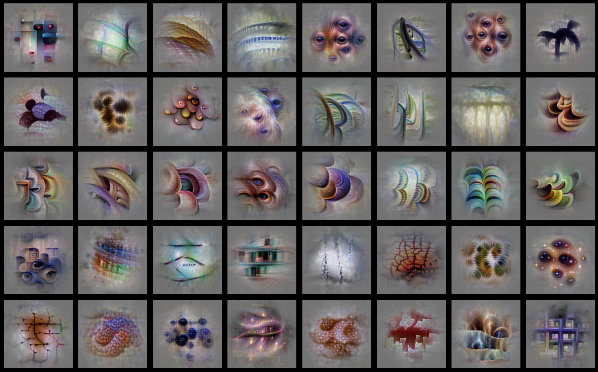

# DualNeuron



A toolkit for synthesizing and screening stimuli that maximally activate neurons in visual cortex areas V1 and V4.

## Overview

**DualNeuron** provides neural network models and synthesis methods to:
- **Screen** large datasets (ImageNet, custom renders) to find images that strongly activate specific neurons
- **Synthesize** optimal stimuli through gradient ascent to maximize neuron responses
- **Analyze** visual preferences of individual neurons in task-driven models

The package includes pre-trained models for two visual areas:
- **V1GrayTaskDriven** (458 neurons) - grayscale processing
- **V4ColorTaskDriven** (394 neurons) - color processing

## Key Features

### 🔍 Screening
Efficiently compute neuron activations across large image datasets, identifying which images best drive each neuron.

### 🎨 Synthesis
Generate "most exciting inputs" (MEIs) using Fourier-parameterized gradient ascent with natural image priors.

### 🧠 Dual Neurons
Each neuron has two poles:
- **Most activating**: stimuli that maximize response
- **Least activating**: stimuli that minimize response

## Installation

**Prerequisites:** Python 3.10, `uv`

```bash
python3.10 -m venv .venv --copies
source .venv/bin/activate
uv pip install -e .
```

## Configuration

Create a `.env` file for credentials:

```bash
cp .env.example .env
# Edit .env with your credentials
```

Required variables:
- `HF_TOKEN`: Hugging Face token for ImageNet access
- `DATA_DIR`: Path to your data directory

## Quick Start

### Screening Images

```python
from dualneuron.screening.run import activations

# Get neuron responses to ImageNet
responses, indices = activations(
    data_dir="path/to/imagenet",
    token="your_hf_token",
    split='test',
    dataset="imagenet",
    area='v4',
    batch_size=128
)
```

### Synthesizing Optimal Stimuli

```python
from dualneuron.synthesis.generate import generate_poles
from dualneuron.twins.nets import V4ColorTaskDriven

# Generate MEIs for V4 neurons
generate_poles(
    output_dir="results/",
    num_seeds=5,
    v4_neurons=394
)
```

### Loading Models

```python
from dualneuron.twins.nets import V4ColorTaskDriven, V1GrayTaskDriven

# Load V4 color model (ensemble of 5 models)
v4_model = V4ColorTaskDriven(ensemble=True, centered=True)

# Load V1 grayscale model
v1_model = V1GrayTaskDriven(ensemble=True, centered=True)
```

## Project Structure

```
dualneuron/
├── screening/          # Dataset screening utilities
│   ├── run.py         # Activation computation
│   └── sets.py        # ImageNet & rendered image loaders
├── synthesis/         # MEI generation
│   ├── ascend.py      # Gradient ascent optimization
│   ├── generate.py    # High-level synthesis interface
│   ├── ops.py         # Image operations
│   └── visualize.py   # Visualization utilities
└── twins/             # Pre-trained models
    ├── nets.py        # V1 & V4 model loaders
    ├── V1GrayTaskDriven/
    └── V4ColorTaskDriven/
```

## License

MIT

## Author

Nikos Karantzas