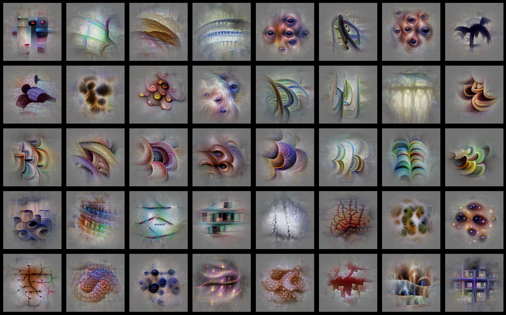

# DualNeuron



**DualNeuron** is the codebase accompanying our paper:

> **Dual-feature selectivity enables bidirectional coding in visual cortical neurons**  
> Franke K.\*, Karantzas N.\*, Willeke K., Diamantaki M., Ramakrishnan K., Bedel H.A., Elumalai P., Restivo K., Fahey P., Nealley C., Shinn T., Garcia G., Patel S., *et al.*  
> bioRxiv (2025)  
> [https://doi.org/10.1101/2025.07.16.665209](https://doi.org/10.1101/2025.07.16.665209)

The data required to reproduce our results is available on Dryad:  
[https://doi.org/10.5061/dryad.q573n5tx3](https://datadryad.org/dataset/doi:10.5061/dryad.q573n5tx3)

---

## Overview

We discovered that many neurons in visual cortex exhibit **dual-feature selectivity**—they respond strongly to preferred features while being systematically suppressed by distinct non-preferred features around elevated baseline firing rates. This **bidirectional coding** strategy appears conserved across species (macaque and mouse) and visual areas (from V1 to V4).

This package provides tools to:

- **Load digital twin models**: Pretrained neural predictive models (deep learning models trained to predict neural responses from images) for macaque V1 and V4
- **Screen large image datasets**: Identify most-activating (MAIs) and least-activating (LAIs) natural images for each neuron
- **Synthesize optimal stimuli**: Generate most-exciting inputs (MEIs) and least-exciting inputs (LEIs) via gradient-based optimization. The synthesis algorithm uses ideas from [https://github.com/serre-lab/Horama](https://github.com/serre-lab/Horama) for optimization in the frequency domain, though the implementation has been extended with different transforms and alternative constraints.
- **Compute semantic axes**: Use DreamSim embeddings to analyze semantic relationships between high and low activation poles
- **Visualize and analyze**: Plot activation curves, population statistics, and optimization trajectories

## Key Concepts

### Bidirectional Neural Coding

Traditional views characterize neurons by what excites them. Our work reveals that neurons also have a **low pole**—stimuli that systematically suppress activity below baseline. The full response range spans from:

- **High Pole (MEI/MAI)**: Stimuli maximizing neural response
- **Low Pole (LEI/LAI)**: Stimuli minimizing neural response (maximal suppression)

### Digital Twin Models

We trained neural predictive models on recordings from:

| Model | Area | Neurons | Input Size | Backbone |
|-------|------|---------|------------|----------|
| `V1GrayTaskDriven` | Macaque V1 | 458 | 93×93 grayscale | ConvNeXtV2-Atto |
| `V4ColorTaskDriven` | Macaque V4 | 394 | 100×100 RGB | ResNet50 L2-robust |
| `V4GrayTaskDriven` | Macaque V4 | 1244 | 100×100 grayscale | ResNet50 L2-robust |

Each model uses **ensemble averaging** (5-10 models) for robust predictions and **Gaussian readouts** for spatial pooling.

## Installation

**Requirements:** Python ≥3.10

```bash
# Create virtual environment
python3.10 -m venv .venv
source .venv/bin/activate

# Install package
pip install -e .
```

## Configuration

Create a `.env` file for credentials:

```bash
HF_TOKEN=your_huggingface_token  # Required for ImageNet access
DATA_DIR=/path/to/data           # Optional: default data directory
```

## Usage

### Loading Digital Twin Models

```python
from dualneuron.twins.nets import V4ColorTaskDriven, V1GrayTaskDriven, load_model

# Load V4 color model (ensemble of 5 models)
v4_model = V4ColorTaskDriven(ensemble=True, centered=True)

# Load V1 grayscale model
v1_model = V1GrayTaskDriven(ensemble=True, centered=True)

# Or use the unified loader with layer extraction
model = load_model(
    architecture='v4',      # 'v1', 'v4', 'v4g', or standard architectures
    layer=None,             # Extract from specific layer (optional)
    ensemble=True,
    centered=True,          # Center readout for MEI synthesis
    device='cuda'
)
```

### Screening Large Image Datasets

Identify which natural images most/least activate each neuron:

```python
from dualneuron.screening.run import screen_activations

# Screen ImageNet to find MAIs/LAIs
sorted_responses, sorted_indices = screen_activations(
    data_dir="/path/to/imagenet",
    token="your_hf_token",
    split='train',
    dataset="imagenet",     # or "rendered" for synthetic scenes
    model='v4',             # 'v1', 'v4', or 'v4g'
    batch_size=128,
    device='cuda'
)

# sorted_indices[:, neuron_id][:10]  → LAIs (lowest 10)
# sorted_indices[:, neuron_id][-10:] → MAIs (highest 10)
```

### Synthesizing MEIs and LEIs

Generate optimal stimuli via gradient ascent:

```python
from dualneuron.synthesis.ascend import fourier_ascending, pixel_ascending

# For V4 (color): Fourier-parameterized synthesis with natural priors
result = fourier_ascending(
    objective_function=lambda x: model(x)[:, neuron_id].mean(),
    magnitude_path='natural_rgb.npy',  # Natural image frequency prior
    total_steps=128,
    learning_rate=1.0,
    values_range=(-2.0, 2.0),
    target_norm=40.0,
    device='cuda',
    verbose=True
)

# For V1 (grayscale): Direct pixel optimization
result = pixel_ascending(
    objective_function=lambda x: model(x)[:, neuron_id].mean(),
    image_size=93,
    channels=1,
    total_steps=128,
    learning_rate=0.05,
    target_norm=12.0,
    device='cuda'
)

mei = result['image']           # Synthesized image
alpha = result['alpha']         # Saliency/transparency map
activation = result['activation']  # Final activation value
```

### Batch Generation of MEIs/LEIs

Generate MEIs and LEIs for all neurons:

```python
from dualneuron.synthesis.generate import generate_poles

# Generate both poles for V1 and V4 neurons
generate_poles(
    output_dir="results/",
    num_seeds=5,          # Multiple random initializations
    v1_neurons=458,       # Number of V1 neurons (or list of IDs)
    v4_neurons=394        # Number of V4 neurons (or list of IDs)
)
```

### Semantic Analysis with DreamSim

Compute semantic axes between activation poles:

```python
from dualneuron.dream.axis import semantic_axis
from dualneuron.dream.sim import embeddings
from dreamsim import dreamsim

# Load DreamSim model
dreamsim_model, _ = dreamsim(pretrained=True, device='cuda')

# Compute semantic axis from MAIs to LAIs
axis = semantic_axis(
    images1=mai_images,    # High-activating images
    images2=lai_images,    # Low-activating images
    dreamsim_model=dreamsim_model
)

# Use axis to guide synthesis toward semantic concepts
result = fourier_ascending(
    objective_function=objective,
    simulation_function=dreamsim_model.embed,
    simulation_axis=axis,
    simulation_weight=0.5,  # Weight for semantic guidance
    ...
)
```

### Visualization

```python
from dualneuron.synthesis.visualize import plot_poles, blend, sequence_animation
from dualneuron.screening.visualize import plot_neuron_activation, plot_neuron_poles

# Plot MEI/LEI pair with activation curves
plot_poles(
    images=[lei_image, mei_image],
    activations=[lei_activations, mei_activations]
)

# Blend image with saliency map
blended = blend(image, alpha, mean=0.45, std=0.25)

# Animate optimization trajectory
animation = sequence_animation(
    imgs=all_step_images,
    activities=all_step_activations,
    title="MEI Synthesis"
)

# Plot sorted activation curve for a neuron
plot_neuron_activation(neuron_id=42, resp_dir="responses/", response_stats=stats)
```

## Package Structure

```
dualneuron/
├── twins/                  # Digital twin neural predictive models
│   ├── nets.py            # Model loaders (V1GrayTaskDriven, V4ColorTaskDriven, etc.)
│   ├── activations.py     # Activation extraction utilities
│   ├── V1GrayTaskDriven/  # V1 model weights & metadata
│   ├── V4ColorTaskDriven/ # V4 color model weights & metadata
│   └── V4GrayTaskDriven/  # V4 grayscale model weights & metadata
│
├── screening/              # Large-scale image screening
│   ├── run.py             # Main screening function
│   ├── sets.py            # ImageNet & rendered dataset loaders
│   ├── utils.py           # Statistics (Gini coefficient, adaptive sampling)
│   └── visualize.py       # Population & single-neuron visualizations
│
├── synthesis/              # Stimulus optimization
│   ├── ascend.py          # Fourier & pixel gradient ascent methods
│   ├── generate.py        # Batch MEI/LEI generation
│   ├── ops.py             # Image operations (crops, noise, normalization)
│   ├── visualize.py       # Optimization trajectory visualization
│   └── priors/            # Natural image magnitude spectra
│       ├── natural_gray.npy
│       └── natural_rgb.npy
│
└── dream/                  # Semantic embedding analysis
    ├── axis.py            # Semantic axis computation
    └── sim.py             # DreamSim embedding extraction
```

## Data Availability

The full dataset (25 GB) supporting our findings is available at:  
[https://doi.org/10.5061/dryad.q573n5tx3](https://datadryad.org/dataset/doi:10.5061/dryad.q573n5tx3)

This includes:
- 200,000 synthetically rendered scenes (236×236 PNG)
- MEIs and LEIs for all neurons (V1 and V4)
- Sorted ImageNet indices (MAIs/LAIs)
- Predicted activation profiles
- Baseline firing rates and reliability metrics

## Citation

If you use this code, please cite our paper:

```bibtex
@article{franke2025dual,
  title={Dual-feature selectivity enables bidirectional coding in visual cortical neurons},
  author={Franke, Katrin and Karantzas, Nikolaos and others},
  journal={bioRxiv},
  year={2025},
  doi={10.1101/2025.07.16.665209}
}
```

## License

MIT

## Authors

Nikos Karantzas